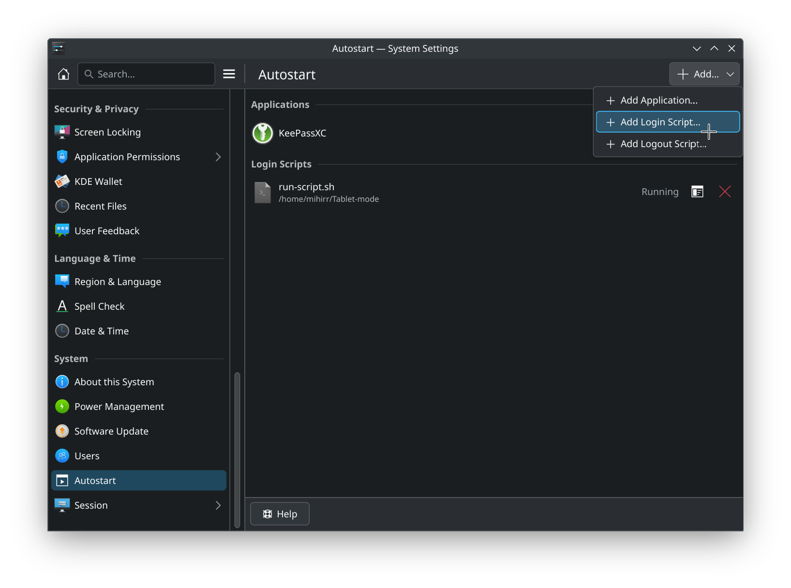

# KDE Auto Touch mode

A python script to automatically toggle KDE's `touch mode` when your touchpad is detached.

Inspired by this [thread][Thread].

## Usage

Add `run-script.sh` in System Settings > Autostart



## Contributing

1. Install [Rye](https://rye.astral.sh/)
2. Run:
   ```bash
   rye sync
   ```
3. Do coding/improvements
4. Commit the code. Commits must be [signed](https://docs.github.com/en/authentication/managing-commit-signature-verification/signing-commits)!
5. Submit PR

## Licence

Consider it to be a part of Public Domain? 🤔
Else whatever licence that [thread][Thread] had at the time of `2024-07-27 19:26:25 pm UTC +05:30`.

[Thread]: https://discuss.kde.org/t/a-script-to-toggle-tablet-mode-or-touch-mode-on-plasma/19224
